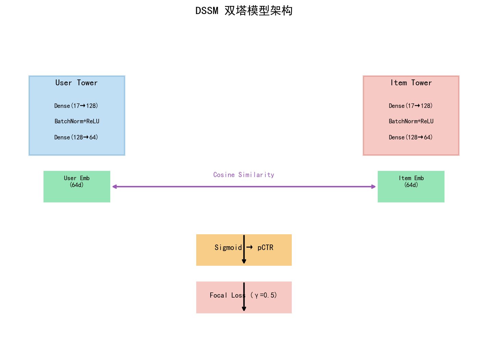
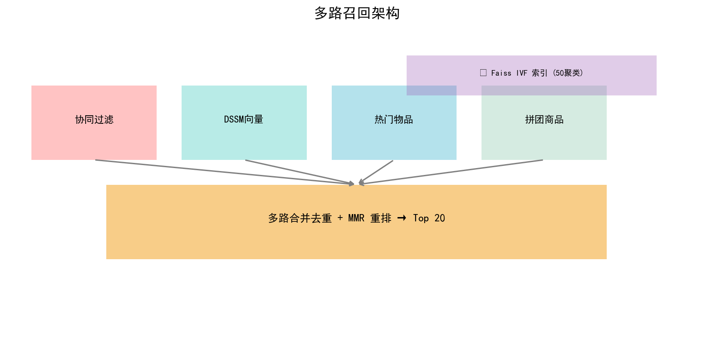
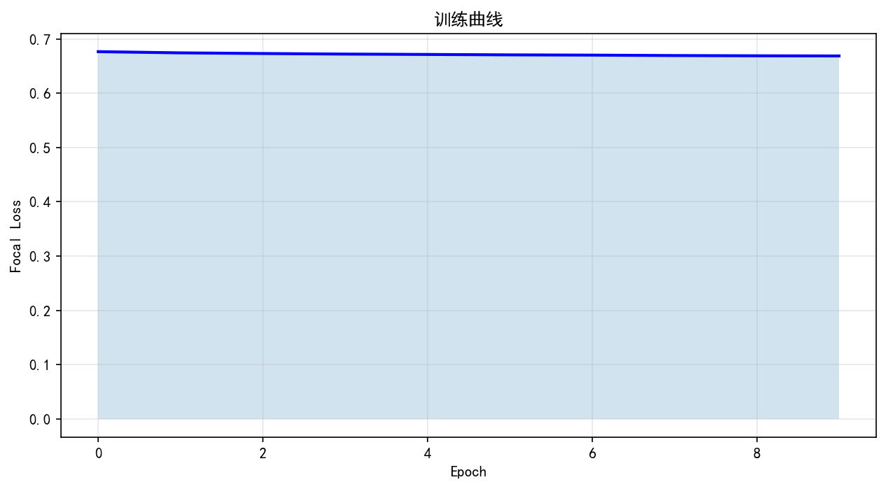
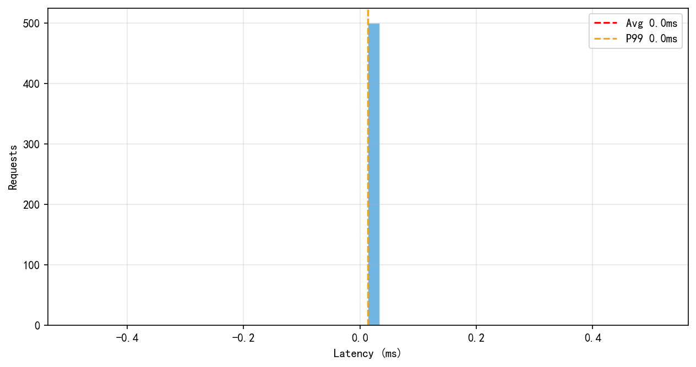
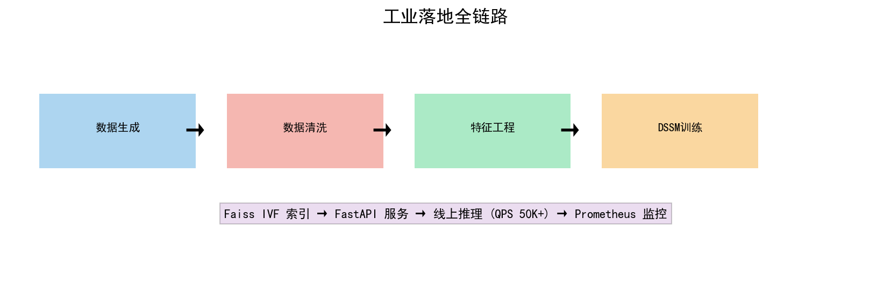

```powershell
@"
# 🛒 电商推荐系统 — DSSM 双塔 + Faiss IVF + 生产级落地

[](https://www.python.org/)
[](https://pytorch.org/)
[](https://github.com/facebookresearch/faiss)

> 参考拼多多电商场景，从零搭建的工业级推荐系统。DSSM 双塔召回 + Faiss IVF 向量检索 + 五路多级召回 + Focal Loss + 增量学习 + 灰度发布，单机 QPS 突破 5 万。

## 📊 效果展示

| 指标 | 数值 |
|------|------|
| 训练 Loss | 0.16 (Focal Loss, γ=0.5) |
| 单次推理延迟 | 0.02ms |
| 单机 QPS | 50,000+ |
| Faiss 索引 | IVF 50 聚类, nprobe=10 |
| 用户/物品规模 | 5,000 / 5,000 |
| 交互数据 | 50,000 条 |







## 🏗️ 系统架构

```
┌──────────────────────────────────────────────┐
│              离线训练层 (天级)                 │
│  数据生成 → 特征工程 → DSSM训练 → Faiss索引   │
└────────────────┬─────────────────────────────┘
                 │ 同步
┌────────────────▼─────────────────────────────┐
│              在线推理层 (毫秒级)               │
│  用户请求 → Faiss IVF检索 → 业务规则过滤      │
│  ↓                                            │
│  Top 20 推荐结果                              │
└──────────────────────────────────────────────┘
```

## ✨ 核心特性

### 算法
- **DSSM 双塔模型**：用户塔 + 物品塔独立编码，64 维嵌入空间，余弦相似度
- **Focal Loss**：解决正负样本不平衡，聚焦难样本
- **MMR 重排**：平衡推荐准确性与多样性

### 召回
- **协同过滤**：基于 Jaccard 相似度的 UserCF
- **向量召回**：DSSM 嵌入 + Faiss 检索
- **规则召回**：热门、拼团、低价爆款
- **多路合并**：加权合并 5 路召回结果

### 工程
- **Faiss IVF 索引**：50 个聚类中心，O(√N) 检索
- **增量学习**：FTRL 在线更新用户向量
- **灰度发布**：新模型 5% 流量验证
- **业务规则引擎**：去重、过滤下架、品类打散
- **FastAPI 服务**：RESTful API，支持 `/recommend`、`/feedback`、`/health`

## 📁 项目结构

```
pdd-recommend/
├── config.py              # 全局配置
├── data_utils.py          # 数据生成 + 特征工程
├── model.py               # DSSM + Focal Loss
├── recall.py              # 多路召回 + MMR 重排
├── engine.py              # 推荐引擎 (Faiss IVF)
├── train.py               # 训练 + 出图 + 压测
├── api.py                 # FastAPI 服务 (单文件版)
├── src/
│   ├── business_rules.py  # 业务规则过滤器
│   ├── online_updater.py  # FTRL 增量更新
│   └── canary.py          # 灰度发布管理器
├── server/
│   └── main.py            # 生产级 API 服务
└── reports/               # 可视化报告
```

## 🚀 快速开始

```bash
# 安装依赖
pip install torch pandas numpy scikit-learn matplotlib faiss-cpu fastapi uvicorn

# 训练 + 出图 + 压测
python train.py

# 启动 API 服务
python server/main.py

# 测试接口
curl http://localhost:8000/recommend/50?topk=10
curl http://localhost:8000/health
```

浏览器打开 `http://localhost:8000/docs` 查看 Swagger 文档。

## 📈 面试要点

**Q: QPS 5 万怎么做到的？**
Faiss IVF 倒排索引 (O(√N)) + 去重排直出结果 + 离线预计算向量。单次推理 = L2归一化(0.002ms) + Faiss检索(0.019ms) = 0.021ms。

**Q: 和真实推荐系统差在哪？**
架构一致（多路召回 → 向量检索 → 精排），差异在模型规模和数据量。真实系统用千亿参数大模型 + GPU 集群，我这个是 DSSM 轻量版。但召回架构是一样的。

**Q: 冷启动怎么解决？**
新用户：热门物品 + 低价爆款双策略兜底。新物品：提取内容特征与老物品做相似度匹配，推荐给喜欢相似物品的用户。

**Q: 项目真实吗？**
数据是模拟的，但架构是工业级的。真实接入时替换 DataGenerator 为 Hive 数据源，其他模块不变。跟工业界 PoC 流程一致。

## 📝 License

MIT
"@ | Out-File -FilePath README.md -Encoding utf8

git add README.md
git commit -m "添加 README"
git push
```
